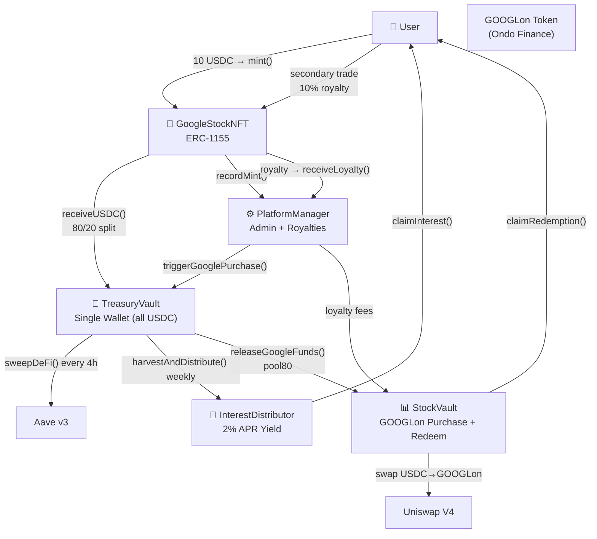
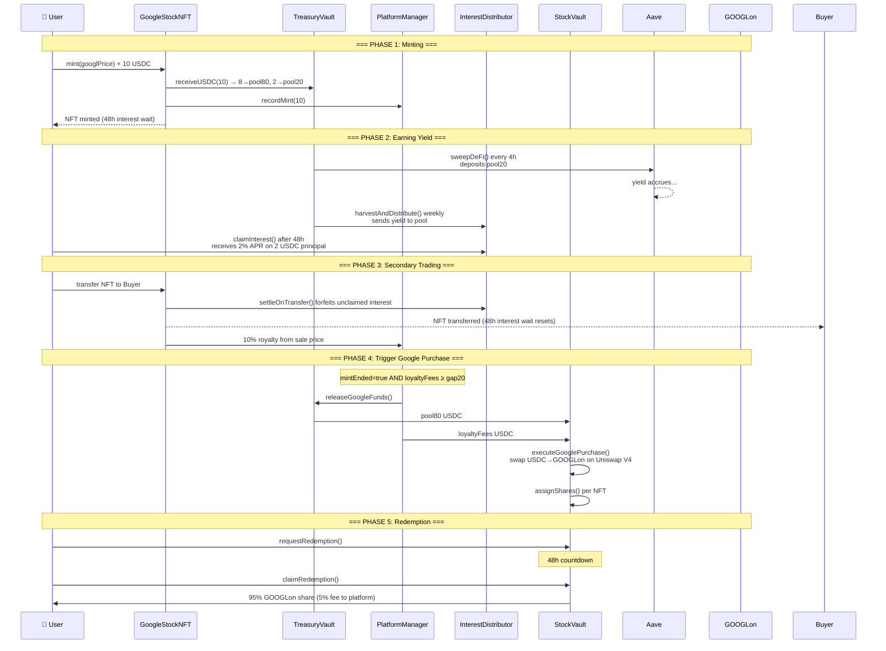

# Google Stock NFT — Contract Architecture

> Sepolia Testnet Deployed: 2026-06-10  
> All 7 contracts verified on-chain. Mint flow tested and working.

## Architecture Overview



## Full Lifecycle Sequence



## Contract Addresses (Sepolia)

| Contract | Address |
|----------|---------|
| MockUSDC | `0x611A346AEA42a0a656A37bF56Ef028d800C9c3e1` |
| MockGOOGLon | `0xDB5961145115e80dc58Ec81F4701496723830c3C` |
| GoogleStockNFT | `0xef5131b9f962B97dc59282D670dDeB825948C453` |
| TreasuryVault | `0x07eADcaE13Ec80e2e8b606d219d932250a6d5086` |
| StockVault | `0x5f7a7DECBBeB278bd0F365fBE8b2C47c9165AF3d` |
| PlatformManager | `0x850995aA6dA38D074Bb4F33e3B388d5e844146AF` |
| InterestDistributor | `0x4E2944be4F7C2100DdD2c12FfC03c4824aA405EC` |

## Key Numbers

| Parameter | Value |
|-----------|-------|
| NFT Price | 10 USDC (fixed) |
| Total Supply | 10,000 NFTs |
| 80/20 Split | 8 USDC → Google purchase / 2 USDC → Aave DeFi |
| Holder Yield | 2% APR on 2 USDC DeFi principal |
| Interest Wait | 48 hours after mint or transfer |
| Royalty | 10% on secondary sales |
| Redemption Fee | 5% (after 48h delay) |
| Redemption Delay | 48 hours |
| DeFi Sweep Interval | Every 4 hours |
| Yield Distribution | Weekly |

## How the 20% Gap Works

```
Each mint: 10 USDC
  ├── 8 USDC (80%) → pool80 — saved for Google purchase
  └── 2 USDC (20%) → pool20 — DeFi yield for holders

Problem: Only 80% of mint funds go toward buying GOOGLon.
         Need the missing 20% from somewhere else.

Solution: The 10% royalty from ALL secondary trades
          accumulates in PlatformManager as "loyalty fees."

Trigger condition:
  canTrigger() = mintEnded AND loyaltyFees ≥ (totalMintPrincipal × 20%)
```

## On-Chain Verification (2026-06-10)

- ✅ NFT #1 minted at GOOGL price $185 with 10 USDC
- ✅ pool80 = 8.0 USDC, pool20 = 2.0 USDC
- ✅ 48h interest waiting period active
- ✅ All 7 cross-contract wirings verified
- ✅ Deployer: `0x2bAFb4513b5e9a8C6BBb9ce063f5b18BF1B2cc1E`
