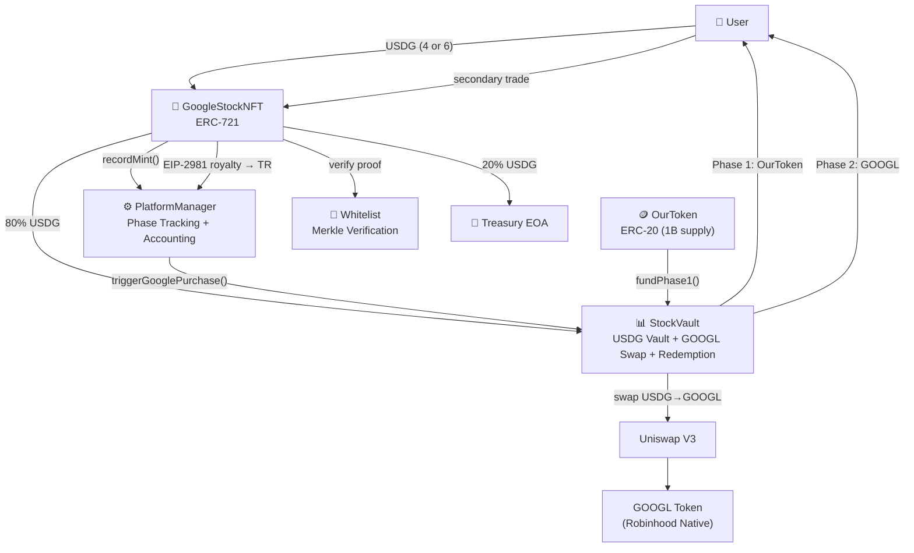
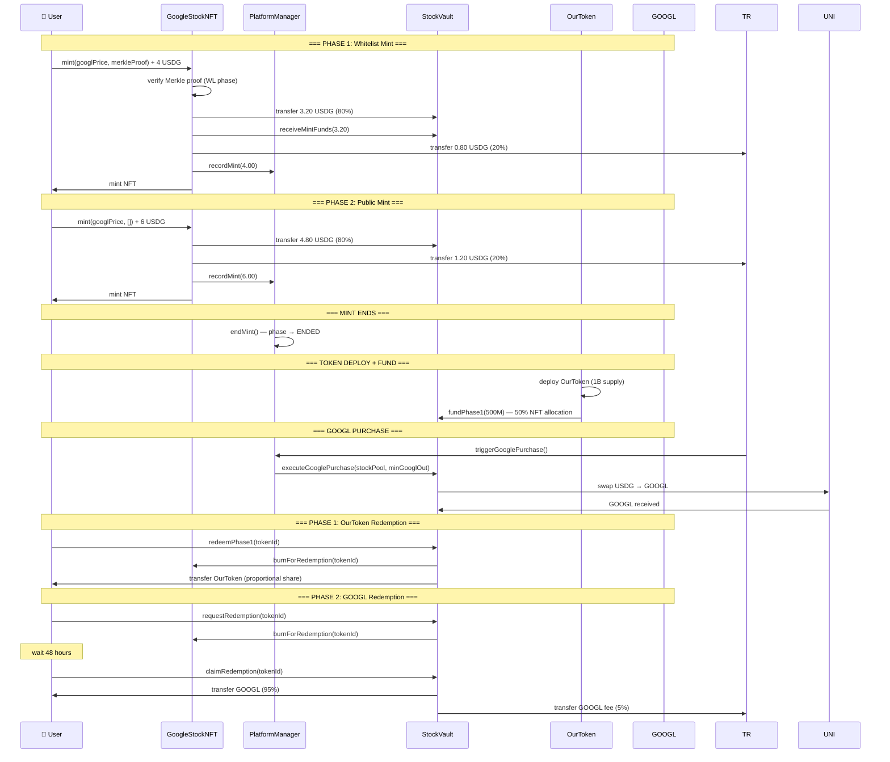

# Google Stock NFT V2 — Contract Architecture

> Robinhood Chain (Arbitrum L2)  
> Last updated: 2026-07-19

## Architecture Overview

```mermaid
graph TD
    USER["👤 User"]
    NFT["🎨 GoogleStockNFT<br/>ERC-721"]
    PM["⚙️ PlatformManager<br/>Phase Tracking + Accounting"]
    SV["📊 StockVault<br/>USDG Vault + GOOGL Swap + Redemption"]
    OT["🪙 OurToken<br/>ERC-20 (1B supply)"]
    WL["🔐 Whitelist<br/>Merkle Verification"]
    UNI["Uniswap V3"]
    GOOGL["GOOGL Token<br/>(Robinhood Native)"]
    TR["🏦 Treasury EOA"]

    USER -->|"USDG (4 or 6)"| NFT
    NFT -->|"80% USDG"| SV
    NFT -->|"20% USDG"| TR
    NFT -->|"recordMint()"| PM
    NFT -->|"verify proof"| WL
    PM -->|"triggerGooglePurchase()"| SV
    SV -->|"swap USDG→GOOGL"| UNI
    UNI --> GOOGL
    OT -->|"fundPhase1()"| SV
    SV -->|"Phase 1: OurToken"| USER
    SV -->|"Phase 2: GOOGL"| USER
    USER -->|"secondary trade"| NFT
    NFT -->|"EIP-2981 royalty → TR"| PM
```

## Full Lifecycle

```mermaid
sequenceDiagram
    participant U as 👤 User
    participant N as GoogleStockNFT
    participant P as PlatformManager
    participant S as StockVault
    participant O as OurToken
    participant G as GOOGL

    Note over U,G: === PHASE 1: Whitelist Mint ===
    U->>N: mint(googlPrice, merkleProof) + 4 USDG
    N->>N: verify Merkle proof (WL phase)
    N->>S: transfer 3.20 USDG (80%)
    N->>S: receiveMintFunds(3.20)
    N->>TR: transfer 0.80 USDG (20%)
    N->>P: recordMint(4.00)
    N->>U: mint NFT

    Note over U,G: === PHASE 2: Public Mint ===
    U->>N: mint(googlPrice, []) + 6 USDG
    N->>S: transfer 4.80 USDG (80%)
    N->>TR: transfer 1.20 USDG (20%)
    N->>P: recordMint(6.00)
    N->>U: mint NFT

    Note over U,G: === MINT ENDS ===
    P->>P: endMint() — phase → ENDED

    Note over U,G: === TOKEN DEPLOY + FUND ===
    O->>O: deploy OurToken (1B supply)
    O->>S: fundPhase1(500M) — 50% NFT allocation

    Note over U,G: === GOOGL PURCHASE ===
    TR->>P: triggerGooglePurchase()
    P->>S: executeGooglePurchase(stockPool, minGooglOut)
    S->>UNI: swap USDG → GOOGL
    UNI->>S: GOOGL received

    Note over U,G: === PHASE 1: OurToken Redemption ===
    U->>S: redeemPhase1(tokenId)
    S->>N: burnForRedemption(tokenId)
    S->>U: transfer OurToken (proportional share)

    Note over U,G: === PHASE 2: GOOGL Redemption ===
    U->>S: requestRedemption(tokenId)
    S->>N: burnForRedemption(tokenId)
    Note over U: wait 48 hours
    U->>S: claimRedemption(tokenId)
    S->>U: transfer GOOGL (95%)
    S->>TR: transfer GOOGL fee (5%)
```

## Contract Summary

| # | Contract | Role |
|---|---|---|
| 1 | **GoogleStockNFT** | ERC-721 mint. Two-phase pricing (WL/Public). Merkle whitelist. USDG payment. 80/20 fee split. |
| 2 | **PlatformManager** | Phase state machine. Mint accounting (stockPool/tokenPool). Loyalty tracking. Trigger gate. |
| 3 | **StockVault** | Holds 80% USDG. Inline Uniswap V3 swap. Two-phase redemption (OurToken + GOOGL). |
| 4 | **OurToken** | ERC-20: 1B supply, 6 decimals. 5-way allocation. Deployed after mint-out. |
| 5 | **Whitelist** | Merkle tree verification for Phase 1. Built after WL collection. |
| 6 | **DiamondHands** | Time-based holding rewards (1×–5×). Built after core contracts. |

## Tokenomics

| Attribute | Value |
|---|---|
| **Payment Token** | USDG (Paxos stablecoin, 6 decimals) |
| **Total NFTs** | 4,083 |
| **Phase 1 (WL)** | 1,500 NFTs at 4 USDG |
| **Phase 2 (Public)** | 2,583 NFTs at 6 USDG |
| **Total Raised** | 21,498 USDG |
| **Fee Split** | 80% StockVault / 20% Treasury |
| **OurToken Supply** | 1,000,000,000 (1B) |
| **OurToken Decimals** | 6 |
| **Redemption Fee** | 5% (GOOGL) |
| **Redemption Delay** | 48 hours |
| **Royalty (EIP-2981)** | 10% |

## Key Mainnet Addresses (Robinhood Chain)

| Contract | Address |
|---|---|
| GOOGL | `0x2e0847E8910a9732eB3fb1bb4b70a580ADAD4FE3` |
| USDG | `0x5fc5360D0400a0Fd4f2af552ADD042D716F1d168` |
| WETH | `0x0Bd7D308f8E1639FAb988df18A8011f41EAcAD73` |
| SwapRouter02 | `0xcaf681a66d020601342297493863e78c959e5cb2` |
| UniswapV3Factory | `0x1f7d7550b1b028f7571e69a784071f0205fd2efa` |

