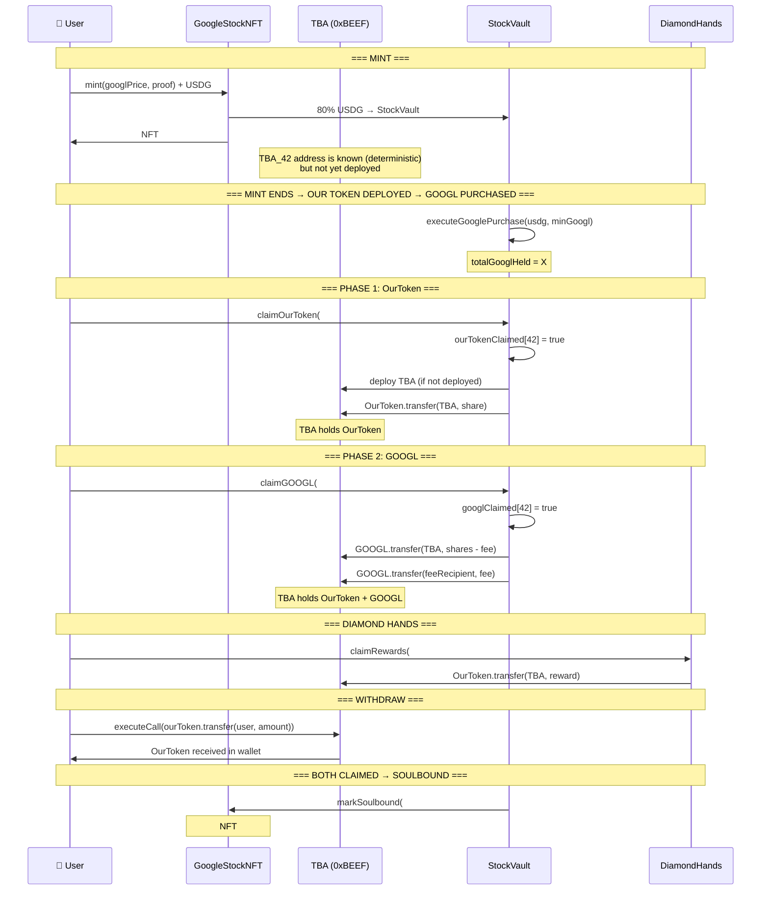

# ERC-6551 Integration — GoogleStockNFT V2

> **Target Audience:** AI building session (DeepSeek V4 Pro)  
> **Purpose:** Complete specification for integrating Token Bound Accounts into the GoogleStockNFT protocol.  
> **Date:** 2026-07-19  
> **Status:** Design Phase

---

## 1. What Is ERC-6551?

ERC-6551 gives every NFT its own smart contract wallet — a **Token Bound Account (TBA)** . The TBA address is deterministically derived from `(NFT contract address, tokenId)`, so it exists *before* it's deployed and can receive assets immediately.

```
┌─────────────────────────────────────────────────┐
│  Alice's Wallet (0xAAA...)                      │
│                                                 │
│  ┌─────────────────────────┐                    │
│  │ GoogleStockNFT #42      │  ← "the key"       │
│  │ ERC-721, owner: Alice   │                    │
│  └──────────┬──────────────┘                    │
│             │ controls                           │
│             ▼                                    │
│  ┌─────────────────────────┐                    │
│  │ TBA_42 (0xBEEF...)      │  ← "the vault"     │
│  │                         │                    │
│  │ Holdings:               │                    │
│  │  • OurToken:  500       │                    │
│  │  • GOOGL:     0.05      │                    │
│  │  • ETH:       0.01      │                    │
│  └─────────────────────────┘                    │
└─────────────────────────────────────────────────┘
```

### Core Interfaces

```solidity
// ERC-6551 Registry — deploys and resolves TBAs
interface IERC6551Registry {
    function createAccount(
        address implementation,  // TBA implementation contract
        bytes32 salt,            // usually 0 for standard deployment
        uint256 chainId,
        address tokenContract,
        uint256 tokenId
    ) external returns (address account);

    function account(
        address tokenContract,
        uint256 tokenId
    ) external view returns (address);
}

// ERC-6551 Account — what each TBA implements
interface IERC6551Account {
    function token() external view returns (uint256 chainId, address tokenContract, uint256 tokenId);
    function owner() external view returns (address);  // = ownerOf(NFT)
    function executeCall(address to, uint256 value, bytes calldata data) external payable returns (bytes memory);
    function isValidSigner(address signer, bytes calldata context) external view returns (bytes4);
}
```

### Key Property: Deterministic Address

```
TBA address = CREATE2(
    registry,
    keccak256(abi.encodePacked(implementation, salt, chainId, tokenContract, tokenId)),
    initCode
)
```

This means:
- The TBA address is **known before deployment**
- You can send tokens to it before any transaction deploys it
- Same inputs → same address, every time, on every chain

### Ownership Model

```
ownerOf(NFT #42) == Alice  ⟺  Alice controls TBA_42
```

When Alice transfers NFT #42 to Bob, Bob automatically controls TBA_42 and all assets inside. No separate approval, no wrapping/unwrapping. OpenSea, Blur, any marketplace — works natively.

---

## 2. What ERC-6551 Brings to GoogleStockNFT

### Current Problem (Burn Model)

```
Phase 1: Burn NFT #42 → get OurToken
Phase 2: ??? → claim GOOGL (how to prove past ownership?)
```

The V2 sequential redemption model (Phase 1 first, Phase 2 later) requires the stock entitlement to **survive NFT destruction**. Without TBA, this requires fragile address-storing mappings and off-chain proofs.

### TBA Solution

| Problem | Without TBA | With TBA |
|---|---|---|
| Stock entitlement survives Phase 1 | `phase1Claimer[42] = Alice` mapping | TBA_42 holds GOOGL directly |
| Secondary buyer knows what's claimed | Must read 3 mappings across 2 contracts | Check TBA balance on-chain |
| Diamond Hands tracking | Off-chain or separate contract | TBA-native timestamp |
| Composability (DeFi) | Not possible | TBA can stake/lend/liquidity-pool |
| Airdrops / future rewards | Must send to last-known owner | Send to TBA — automatically follows NFT owner |

### The NFT Never Burns

Instead of "burn to claim," we use **claim flags**:

```solidity
mapping(uint256 => bool) public ourTokenClaimed;   // Phase 1 done?
mapping(uint256 => bool) public googlClaimed;       // Phase 2 done?
```

After both claimed, the NFT becomes a **"fully redeemed" collectible** — alive, soulbound, holding its claim history permanently on-chain.

---

## 3. Contract Changes — Exact Specification

### 3.1 New Contract: `ERC6551Account.sol`

The TBA implementation. One contract deployed as a minimal proxy (ERC-1167) for each NFT.

```solidity
// SPDX-License-Identifier: MIT
pragma solidity ^0.8.27;

import "@openzeppelin/contracts/token/ERC721/IERC721.sol";
import "@openzeppelin/contracts/token/ERC20/IERC20.sol";
import "@openzeppelin/contracts/token/ERC20/utils/SafeERC20.sol";

interface IERC6551Account {
    function token() external view returns (uint256 chainId, address tokenContract, uint256 tokenId);
    function owner() external view returns (address);
    function executeCall(address to, uint256 value, bytes calldata data) external payable returns (bytes memory);
    function isValidSigner(address signer, bytes calldata context) external view returns (bytes4);
}

/**
 * @title StockNFTAccount
 * @notice ERC-6551 TBA for GoogleStockNFT. Holds OurToken + GOOGL + any other assets.
 *         Ownership = ownerOf(NFT). Only the NFT owner can execute calls.
 */
contract StockNFTAccount is IERC6551Account {
    using SafeERC20 for IERC20;

    uint256 internal _chainId;
    address internal _tokenContract;
    uint256 internal _tokenId;

    // ─── Initialization (called by registry's createAccount) ───
    function initialize(address _nft, uint256 _id) external {
        require(_tokenContract == address(0), "Already initialized");
        _tokenContract = _nft;
        _tokenId = _id;
        _chainId = block.chainid;
    }

    // ─── ERC-6551 Interface ───
    function token() external view returns (uint256, address, uint256) {
        return (_chainId, _tokenContract, _tokenId);
    }

    function owner() public view returns (address) {
        return IERC721(_tokenContract).ownerOf(_tokenId);
    }

    // ─── Execution (only NFT owner) ───
    function executeCall(
        address to,
        uint256 value,
        bytes calldata data
    ) external payable returns (bytes memory result) {
        require(msg.sender == owner(), "Not NFT owner");
        // solhint-disable-next-line avoid-low-level-calls
        (bool success, bytes memory ret) = to.call{value: value}(data);
        require(success, "Call failed");
        return ret;
    }

    // ─── Signature validation (for gasless / relayed TX) ───
    function isValidSigner(address signer, bytes calldata) external view returns (bytes4) {
        if (signer == owner()) {
            return IERC6551Account.isValidSigner.selector;
        }
        return 0xffffffff;
    }

    // ─── Receive ETH ───
    receive() external payable {}
}
```

> ⚠️ **Security note:** The `executeCall` uses `msg.sender == owner()` — this means **only the current NFT holder** can move assets out. This is the core security property.

### 3.2 Changes to `StockVault.sol`

**What changes:**

| Current Function | New Function | Change |
|---|---|---|
| `redeemPhase1(uint256)` | `claimOurToken(uint256)` | NFT NOT burned. OurToken → TBA. `ourTokenClaimed[id] = true`. |
| `requestRedemption(uint256)` | `claimGOOGL(uint256)` | NFT NOT burned. GOOGL → TBA. `googlClaimed[id] = true`. |
| `claimRedemption(uint256)` | ❌ Removed | No more 48h delay. GOOGL goes directly to TBA. |
| — | `tbaForToken(uint256) → address` | Helper: look up TBA address for a tokenId. |

**Key new code:**

```solidity
// StockVault.sol — new imports
import "./interfaces/IERC6551Registry.sol";

// StockVault.sol — new state
address public erc6551Registry;
address public erc6551Implementation;
mapping(uint256 => bool) public ourTokenClaimed;
mapping(uint256 => bool) public googlClaimed;

// StockVault.sol — new helper
function tbaForToken(uint256 tokenId) public view returns (address) {
    return IERC6551Registry(erc6551Registry).account(googleStockNFT, tokenId);
}

function _ensureTBA(uint256 tokenId) internal returns (address tba) {
    tba = tbaForToken(tokenId);
    if (tba.code.length == 0) {
        tba = IERC6551Registry(erc6551Registry).createAccount(
            erc6551Implementation,
            bytes32(0),       // salt
            block.chainid,
            googleStockNFT,
            tokenId
        );
    }
}

// StockVault.sol — replaces redeemPhase1
function claimOurToken(uint256 tokenId) external {
    require(phase1Open, "Phase 1 not open");
    require(!ourTokenClaimed[tokenId], "Already claimed");
    require(_isNFTOwner(tokenId, msg.sender), "Not NFT owner");

    uint256 share = _getOurTokenShare(tokenId);
    require(share > 0, "No OurToken share");
    require(ourToken.balanceOf(address(this)) >= share, "Insufficient");

    ourTokenClaimed[tokenId] = true;
    address tba = _ensureTBA(tokenId);          // deploy TBA if needed
    ourToken.safeTransfer(tba, share);           // send to TBA, NOT msg.sender

    emit Phase1Claimed(tokenId, msg.sender, tba, share);
}

// StockVault.sol — replaces requestRedemption + claimRedemption
function claimGOOGL(uint256 tokenId) external {
    require(purchaseComplete, "Purchase not complete");
    require(!googlClaimed[tokenId], "Already claimed");
    require(_isNFTOwner(tokenId, msg.sender), "Not NFT owner");

    uint256 shares = getShares(tokenId);
    require(shares > 0, "No shares");

    googlClaimed[tokenId] = true;
    address tba = _ensureTBA(tokenId);

    uint256 fee = (shares * REDEMPTION_FEE_BPS) / BPS_DENOMINATOR;
    uint256 toUser = shares - fee;

    googlToken.safeTransfer(tba, toUser);
    googlToken.safeTransfer(feeRecipient, fee);

    emit GOOGLClaimed(tokenId, msg.sender, tba, toUser, fee);
}
```

> ⚠️ **Note:** The 48h redemption delay is REMOVED. If you need the delay back, add a `googlRequestTime[tokenId]` mapping and split into `requestGOOGL` + `claimGOOGL` again. But with TBA, the GOOGL sits in the TBA after claiming — the user still needs a second TX to withdraw from TBA to their EOA. That natural friction might replace the delay.

### 3.3 Changes to `GoogleStockNFT.sol`

| Change | Detail |
|---|---|
| `burnForRedemption()` | **REMOVE.** No burning during claims. |
| New: `ourTokenClaimed` / `googlClaimed` | Or keep these in StockVault (preferred — single source of truth). |
| New: `isFullyRedeemed(tokenId)` | View function: `ourTokenClaimed[id] && googlClaimed[id]`. |
| New: `_beforeTokenTransfer` hook | Block transfers of fully-redeemed NFTs (soulbound). |

```solidity
// GoogleStockNFT.sol — added transfer restriction
mapping(uint256 => bool) public soulbound;  // set when fully redeemed

function _update(address to, uint256 tokenId, address auth)
    internal override(ERC721, ERC721Enumerable) returns (address)
{
    // Block transfers of fully-redeemed NFTs
    if (soulbound[tokenId] && from != address(0)) {
        revert("NFT fully redeemed — soulbound");
    }
    return super._update(to, tokenId, auth);
}

// Called by StockVault after both claims
function markSoulbound(uint256 tokenId) external {
    require(msg.sender == stockVault, "Not StockVault");
    soulbound[tokenId] = true;
}
```

### 3.4 Changes to `PlatformManager.sol`

**Minimal changes.** Add TBA registry setter:

```solidity
address public erc6551Registry;
address public erc6551Implementation;

function setERC6551(address _registry, address _impl) external onlyOwner {
    require(erc6551Registry == address(0), "Already set");
    erc6551Registry = _registry;
    erc6551Implementation = _impl;
}
```

### 3.5 `DiamondHands.sol` (New Contract)

```solidity
// Rewards go to TBA, tracked on-chain
function claimRewards(uint256 tokenId) external {
    address tba = registry.account(nft, tokenId);
    require(IERC721(nft).ownerOf(tokenId) == msg.sender, "Not owner");
    
    uint256 heldDays = (block.timestamp - mintTimestamp[tokenId]) / 1 days;
    uint256 multiplier = computeMultiplier(heldDays);
    uint256 reward = baseReward * multiplier;
    
    ourToken.safeTransfer(tba, reward);
}
```

---

## 4. Security Best Practices

### 4.1 TBA Access Control — THE MOST CRITICAL

```
Owner of NFT → controls TBA → controls ALL assets inside
```

This means: **if the NFT is stolen, ALL TBA assets are stolen too.** No separate approval needed.

| Risk | Mitigation |
|---|---|
| NFT stolen (phishing) | User education. TBA is only as secure as the NFT. |
| NFT transferred during claim TX | Use `_isNFTOwner` check INSIDE the claim function, not from calldata. Always read `ownerOf()` fresh. |
| Front-running claim | Attacker can't claim because `_isNFTOwner` fails. But they COULD buy the NFT right before you claim, then claim themselves. This is acceptable — new owner gets the claim. |
| Reentrancy on TBA deploy | `_ensureTBA` deploys the TBA via registry. The registry's `createAccount` should be non-reentrant. Use OpenZeppelin's `ReentrancyGuard` on all StockVault claim functions. |

### 4.2 Reentrancy Protection

```solidity
// StockVault.sol — ALL claim functions MUST use nonReentrant
function claimOurToken(uint256 tokenId) external nonReentrant { ... }
function claimGOOGL(uint256 tokenId) external nonReentrant { ... }
```

The TBA receives tokens — if the receiving token has a callback (ERC-777, some ERC-20 variants), reentrancy is possible.

### 4.3 State Update Before External Calls

```solidity
// CORRECT order (Checks-Effects-Interactions):
ourTokenClaimed[tokenId] = true;        // 1. Update state FIRST
address tba = _ensureTBA(tokenId);      // 2. External call (deploy)
ourToken.safeTransfer(tba, share);      // 3. External call (transfer)
```

### 4.4 TBA Implementation Security

| Property | Requirement |
|---|---|
| **Upgradeability** | ❌ DO NOT make the TBA implementation upgradeable. It's a minimal proxy — the implementation must be immutable. |
| **Initialization** | Use `require(_tokenContract == address(0))` guard. Cannot re-initialize. |
| **`executeCall` target validation** | Do NOT restrict targets. The TBA owner must be able to call any contract — that's the point of a wallet. |
| **ETH handling** | `receive()` must exist. Without it, ETH transfers to TBA revert. |
| **`isValidSigner`** | Must return `0xffffffff` for invalid signers (ERC-6551 spec), not revert. |

### 4.5 Registry Trust

The ERC-6551 Registry is the factory for all TBAs. Use the **canonical registry** if deployed on Robinhood Chain, or deploy the standard one:

```
Canonical ERC-6551 Registry:  0x000000006551c19487814612e58FE06813775758 (Ethereum mainnet)
Canonical Account Implementation: 0x55266d75D1a14E4572138116aF39863Ed6596E7F (simple)
```

If Robinhood Chain doesn't have these, deploy them from the [ERC-6551 reference](https://github.com/erc6551/reference).

### 4.6 Bridge / L2 Considerations

Robinhood Chain is an Arbitrum Orbit L2. TBAs deployed on Robinhood Chain exist ONLY on Robinhood Chain. If the NFT is bridged to Ethereum L1, the TBA does NOT follow. This is a known ERC-6551 limitation — TBAs are chain-specific.

### 4.7 TBA Withdrawal Pattern

Users need a way to get assets OUT of the TBA. Options:

```solidity
// Option A: User calls TBA directly (standard)
// tba.executeCall(ourToken, 0, abi.encodeWithSignature("transfer(address,uint256)", user, amount));

// Option B: StockVault provides a convenience function
function withdrawFromTBA(uint256 tokenId, address token, uint256 amount) external {
    require(_isNFTOwner(tokenId, msg.sender), "Not owner");
    address tba = tbaForToken(tokenId);
    require(tba.code.length > 0, "TBA not deployed");
    IERC6551Account(tba).executeCall(
        token, 0,
        abi.encodeWithSignature("transfer(address,uint256)", msg.sender, amount)
    );
}
```

Option B is recommended — most users won't know how to call `executeCall` directly.

---

## 5. Attack Surface — What to Audit

| # | Attack Vector | Severity | Check |
|---|---|---|---|
| 1 | Claim another user's tokens | Critical | `_isNFTOwner` uses `ownerOf()`, not `msg.sender` from calldata |
| 2 | Double-claim | Critical | `ourTokenClaimed[id]` / `googlClaimed[id]` boolean guards |
| 3 | Reentrancy via token callback | High | `nonReentrant` modifier on all claim functions |
| 4 | TBA front-run deployment | Medium | Registry uses CREATE2 — address is deterministic, can't be hijacked |
| 5 | Fully redeemed NFT sold as "live" | Medium | Soulbound check in `_update` + metadata reflects redeemed state |
| 6 | StockVault drains TBA | Low | StockVault needs approval from TBA to withdraw. Never approve StockVault on the TBA. |
| 7 | Registry implementation swap | Low | Use immutable registry address. Do not make registry upgradeable. |
| 8 | `executeCall` to malicious contract | Low | TBA owner intentionally calls it — same risk as any wallet. Not a protocol bug. |

---

## 6. Gas Economics

| Operation | Gas Estimate | Notes |
|---|---|---|
| TBA deployment (first claim) | ~250,000 | CREATE2 + proxy + initialize |
| claimOurToken (after TBA deployed) | ~80,000 | State update + single ERC-20 transfer to TBA |
| claimGOOGL (after TBA deployed) | ~100,000 | State update + two ERC-20 transfers (user + fee) |
| Withdraw from TBA | ~60,000 | `executeCall` + ERC-20 transfer |
| Full lifecycle per NFT | ~490,000 | deploy + claim phase 1 + claim phase 2 + withdraw |

At 4,083 NFTs: total protocol gas ≈ 2B gas. Acceptable for an L2 (Arbitrum Orbit).

---

## 7. The NFT Lifecycle — End to End



---

## 8. Files to Create / Modify

| File | Action | Description |
|---|---|---|
| `contracts/ERC6551Account.sol` | **CREATE** | TBA implementation (simple wallet) |
| `contracts/interfaces/IERC6551Registry.sol` | **CREATE** | Registry interface |
| `contracts/interfaces/IERC6551Account.sol` | **CREATE** | Account interface |
| `contracts/ERC6551Registry.sol` | **CREATE** (if not on Robinhood) | Canonical registry deployment |
| `contracts/StockVault.sol` | **MODIFY** | Replace redeemPhase1 + request/claimRedemption with claimOurToken + claimGOOGL. Add TBA helpers. Add ReentrancyGuard. |
| `contracts/GoogleStockNFT.sol` | **MODIFY** | Remove burnForRedemption. Add soulbound mapping + _update override. Add markSoulbound. |
| `contracts/PlatformManager.sol` | **MODIFY** | Add erc6551Registry + erc6551Implementation setters. |
| `contracts/DiamondHands.sol` | **MODIFY** (when built) | Rewards go to TBA, not user EOA. |

---

## 9. Deployment Order

```
1. Deploy ERC6551Registry
2. Deploy ERC6551Account implementation
3. Deploy GoogleStockNFT (unchanged constructor)
4. Deploy PlatformManager (unchanged constructor)
5. Deploy StockVault (add registry + impl to constructor or setter)
6. Wire up: NFT.setPlatformManager() → NFT.setStockVault() → PM.setGoogleStockNFT() → PM.setStockVault() → SV.setGoogleStockNFT() → PM.setERC6551()
7. Open whitelist → mint → end → deploy OurToken → fund Phase 1
8. Trigger Google purchase
9. Open Phase 1 → users claim OurToken
10. Open Phase 2 → users claim GOOGL
11. Deploy DiamondHands → users claim rewards
```

---

## 10. References

- [ERC-6551 Standard](https://eips.ethereum.org/EIPS/eip-6551)
- [Reference Implementation](https://github.com/erc6551/reference)
- [Tokenbound SDK](https://docs.tokenbound.org/)
- [ERC-6551 Registry (canonical)](https://github.com/erc6551/reference/blob/main/src/ERC6551Registry.sol)
- [OpenZeppelin ERC-721](https://docs.openzeppelin.com/contracts/5.x/api/token/erc721)
- [Robinhood Chain Docs](https://docs.robinhood.com/)
