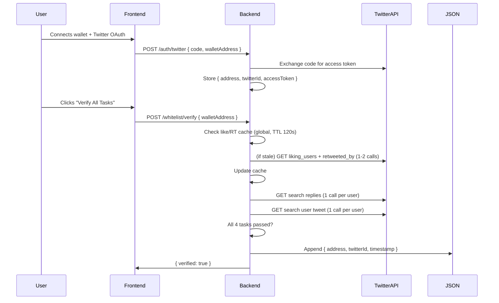

# Whitelist / Airdrop Mechanism

> **Status**: Planned — not yet implemented.
> **Purpose**: Social-task-based whitelist for early-access minting. Users complete Twitter tasks → verified by backend → whitelist JSON → Merkle tree → on-chain WL mint.

---

## Architecture

```
User → Twitter OAuth → Complete Tasks → Backend Verifies → whitelist.json → Merkle Tree → GoogleStockNFT.sol
```

### Flow

1. User connects wallet + Twitter OAuth (`twitter-api-v2`, OAuth 2.0 PKCE)
2. User completes 4 tasks on a single project tweet (like, retweet, comment, post their own tweet)
3. User clicks "Verify All" → backend checks each task via Twitter API v2
4. All 4 pass → address written to `backend/data/whitelist-state.json`
5. Later: script reads JSON → generates Merkle root → updates `GoogleStockNFT.sol`

---

## Data Flow



---

## Cost Strategy

Twitter API is pay-as-you-go. Minimizing calls:

| Data | Strategy | API Cost |
|------|----------|----------|
| Likers list | Cached globally, TTL 120s | 1 call / 120s for ALL users |
| Retweeters list | Cached globally, TTL 120s | 1 call / 120s for ALL users |
| Reply check | Per-user, unavoidable | 1 call per verification |
| User tweet check | Per-user, unavoidable | 1 call per verification |
| **Per-user total** | | **Max 2 paid API calls** |

---

## API Endpoints

| Method | Path | Purpose |
|--------|------|---------|
| `GET` | `/api/twitter/auth-url` | Returns OAuth URL + state. Frontend redirects user. |
| `GET` | `/api/twitter/callback?code=...&state=...` | Twitter redirects here. Exchanges code for token. Stores `{address, twitterId, token}`. Redirects to `/app?tab=whitelist&twitter=ok`. |
| `POST` | `/api/whitelist/verify` | `{ walletAddress }` → checks all 4 tasks → writes state. |
| `GET` | `/api/whitelist/status?address=0x...` | Returns: `{ twitterConnected, tasks, verified, attemptsLeft, nextAttemptAt }`. |

---

## Rate Limiting

- **Max 3 attempts** for verification
- **10 minute interval** between attempts
- After 3 fails → **2 hour cooldown**
- After cooldown → reset to 3 attempts
- After cooldown + 3 more fails → another 2 hour cooldown

---

## Task Verification

| Task | API Call | Verifies |
|------|----------|----------|
| Like | `GET /2/users/:id/liked_tweets` | User liked our tweet |
| Retweet | `GET /2/tweets/:id/retweeted_by` | User retweeted |
| Comment | `GET /2/tweets/search/recent?query=conversation_id:OUR_ID from:USER` | User replied |
| Post tweet | `GET /2/tweets/search/recent?query=from:USER` + keyword match | User posted WL text |

Post verification checks for **contains-keywords**: must include all keywords defined in `TWITTER_POST_KEYWORDS` env var.

---

## Storage

### `backend/data/whitelist-state.json`
```json
{
  "0xabc...": {
    "address": "0xabc...",
    "twitterId": "1592837182",
    "twitterUsername": "@crypto_fan",
    "token": { "access_token": "...", "refresh_token": "..." },
    "verified": false,
    "tasks": { "like": true, "retweet": true, "comment": false, "post": false },
    "attempts": 2,
    "lastAttemptAt": "2026-07-23T14:00:00Z",
    "cooldownUntil": null
  }
}
```

### `backend/data/twitter-cache.json`
```json
{
  "likers": { "data": ["1592837182", ...], "updatedAt": "2026-07-23T14:00:00Z" },
  "retweeters": { "data": ["1592837182", ...], "updatedAt": "2026-07-23T14:00:00Z" }
}
```

---

## Env Vars (backend/.env)

```env
TWITTER_CLIENT_ID=
TWITTER_CLIENT_SECRET=
TWITTER_REDIRECT_URI=http://localhost:3456/auth/twitter/callback
TWITTER_TWEET_ID=              # single tweet for like/RT/comment
TWITTER_POST_KEYWORDS=@stockNFT_ WL ERC-6551 Google Stock  # must contain ALL keywords
```

---

## Frontend Whitelist Tab UI

```
┌────────────────────────────────────────────┐
│  Whitelist                                  │
│  Wallet: 0xAbC...Def                        │
│  Twitter: @crypto_fan ✅                    │
├────────────────────────────────────────────┤
│  Step 1: Like our tweet      [Open]    ⬜   │
│  Step 2: Retweet             [Open]    ⬜   │
│  Step 3: Comment             [Open]    ⬜   │
│  Step 4: Post your tweet     [Tweet]   ⬜   │
├────────────────────────────────────────────┤
│  Attempts: 2/3  |  [Verify All Tasks]      │
│  (Cooldown: 1h 45m remaining if locked)    │
└────────────────────────────────────────────┘
```

- `[Open]` buttons open the tweet in new tab
- `[Tweet]` opens `https://twitter.com/intent/tweet?text=...` with pre-filled text
- All state from `GET /api/whitelist/status`

---

## Dependencies

```
pnpm add twitter-api-v2    ← OAuth 2.0 PKCE + typed Twitter API calls (~50KB)
```

No Express, no database — raw `http` server + JSON files.

---

## Later: Merkle Tree Generation

After whitelist collection is complete:

1. Script reads `backend/data/whitelist-state.json`
2. Filters `verified: true` entries
3. Generates Merkle tree (keccak256 of `abi.encodePacked(address)`)
4. Deploys or updates `GoogleStockNFT.sol` with new `whitelistRoot`
5. During WL mint: contract verifies `MerkleProof.verify(proof, whitelistRoot, leaf)`

---

## Files to Create

```
backend/
├── .env                           ← add TWITTER_* vars
├── data/
│   ├── whitelist-state.json        ← verified users + rate limits
│   └── twitter-cache.json          ← cached likers/RTers
├── src/
│   ├── config.ts                   ← add twitter config section
│   ├── routes/
│   │   ├── twitter-auth.ts         ← OAuth 2.0 PKCE flow
│   │   └── whitelist-verify.ts     ← task verification + rate limiting
│   └── services/
│       └── twitter.service.ts      ← Twitter API wrapper (cached calls)

frontend/
├── src/
│   └── app/
│       └── app/
│           └── page.tsx            ← Whitelist tab UI (replace Redeem placeholder)
```
